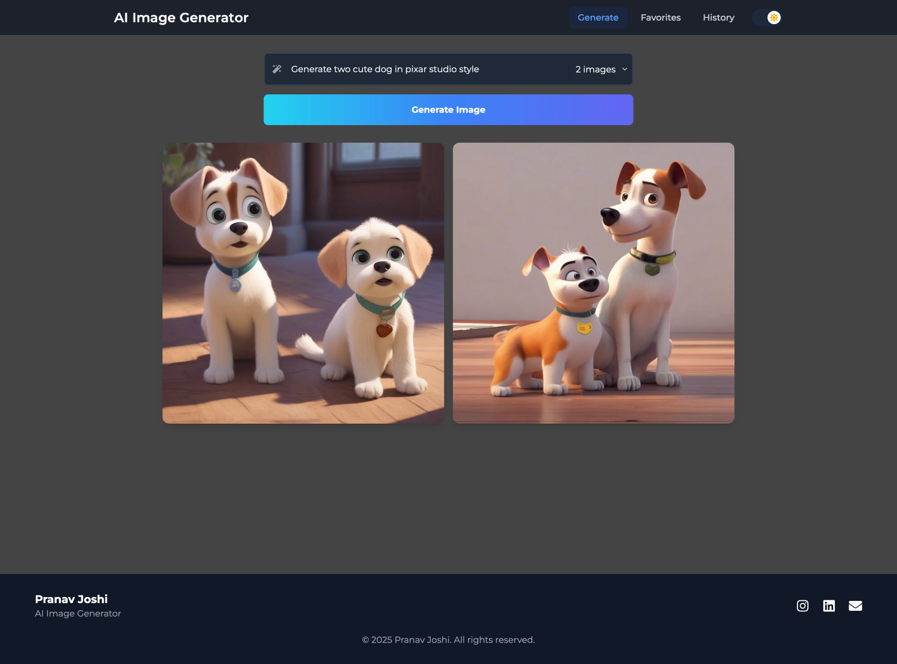

# AI Image Generator

A modern Next.js app that generates AI images from text prompts using Hugging Face’s Stable Diffusion API.

🚀 Features
	•	Generate up to 3 images per prompt
	•	Clean, responsive UI
	•	Real-time feedback with loading and error handling


🔧 Setup

1. Clone the repository:

```bash
git clone <repository-url>
cd ai-image-generator
```

2. Install dependencies:

```bash
npm install
```

3. Create a `.env.local` file in the root directory and add your Hugging Face API key:

```
HUGGINGFACE_API_KEY=your_api_key_here
```

4. Start the development server:

```bash
npm run dev
```

5. Open [http://localhost:3000](http://localhost:3000) in your browser.

🧠 Tech Stack
	•	Next.js
	•	React
	•	Tailwind CSS
	•	Hugging Face API (Stable Diffusion)


📷 [Preview – Visit Site](https://ai-image-generator-ten-theta.vercel.app/)




📄 License

MIT
